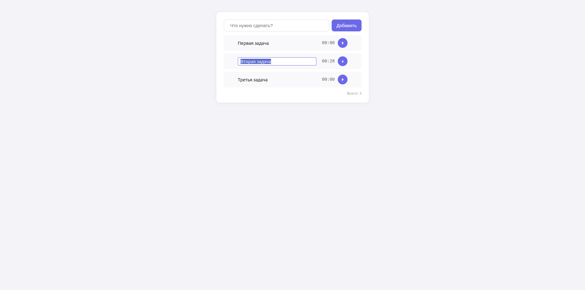
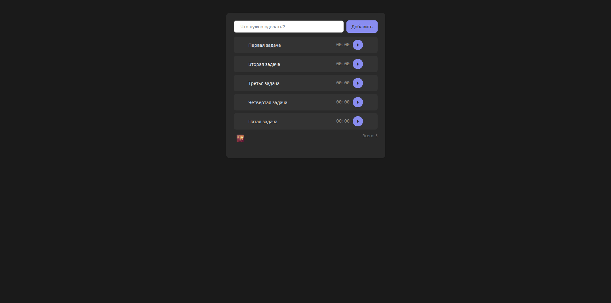

# Todo App

|  |  |

Простой и удобный список задач на чистом JavaScript.

🔗 **[Открыть демо](https://johan-cohan.github.io/todo-app/)**

## Возможности

- ✅ Добавление задач (кнопка или Enter)
- ✅ Удаление задач одним кликом
- ✅ Редактирование задач (инлайн, Enter — сохранить, Esc — отменить)
- ✅ Таймер для каждой задачи (Пуск/Пауза)
- ✅ Сохранение прогресса таймера — продолжает с того же места
- ✅ Только один таймер может идти одновременно
- ✅ Сохранение в localStorage
- ✅ Тёмная тема с сохранением выбора
- ✅ Счётчик задач
- ✅ Пустое состояние с подсказкой

## Технологии

- HTML5
- CSS3 (Flexbox, медиазапросы для мобильной вёрстки)
- JavaScript (ES6+: объекты, `setInterval`, `localStorage`, работа с DOM)
- localStorage API

## Как запустить локально

1. Склонируй репозиторий:
   ```bash
   git clone https://github.com/Johan-cohan/todo-app.git
   ```
2. Открой `index.html` в браузере.

Или просто открой [живую версию](https://johan-cohan.github.io/todo-app/).

## Что можно улучшить

- [ ] Экспорт/импорт задач в JSON
- [ ] Отметка задач «выполнено» и фильтры (все / активные / выполненные)
- [ ] Кастомные фоны для тёмной темы (например, из комиксов Marvel / DC)**
- [ ] Категории или теги для задач
- [ ] Синхронизация между устройствами (бэкенд + БД)